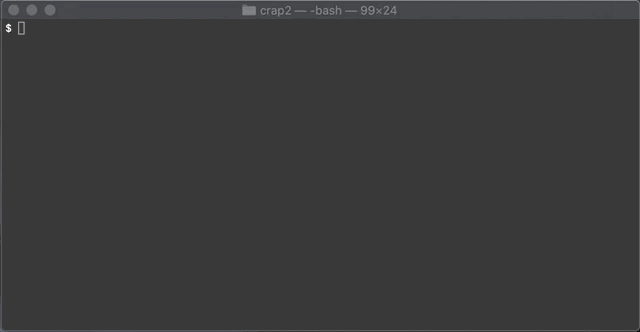

heroku-postico
==============


Tools to make it easier to connect to Heroku postgres databases from [Postico](https://eggerapps.at/postico/). You must have 
Postico installed for this tool to work. If you've never used Postico - it's one of the best Postgres apps for OSX on the market.

* [Installation](#installation)
* [Commands](#commands)
* [Developing](#developing)

# Installation

```sh-session
INSTALLATION
  $ npm install -g @connectedyard/heroku-postico
  $ heroku plugins:install @connectedyard/heroku-postico
  $ heroku postico
```

# Commands

## heroku postico:open

Fetch Heroku postgres databases for a team to choose from a list and connect in Postico.

```sh-session
USAGE
  $ heroku postico:open --team=[your heroku team]
```


## heroku postico:export

Export a folder containing Postico favorite files for all Heroku postgres databases associated with a team.

```sh-session
USAGE
  $ heroku postico:export --team=[your heroku team]
```



Once the favorites are exported, drag & drop the folder onto the postico favorites window.

:warning: :warning: :warning: Be sure to delete the exported 
favorites folder permanently after importing to prevent leaking your passwords.


# Developing

1. Clone the repo.
2. CD into the repo and Link the heroku cli to your local working copy: `heroku plugins:link`.
3. Make your edits and test your changes by running `heroku postico` as you normally would.
4. Send us a PR and we'll review it.
